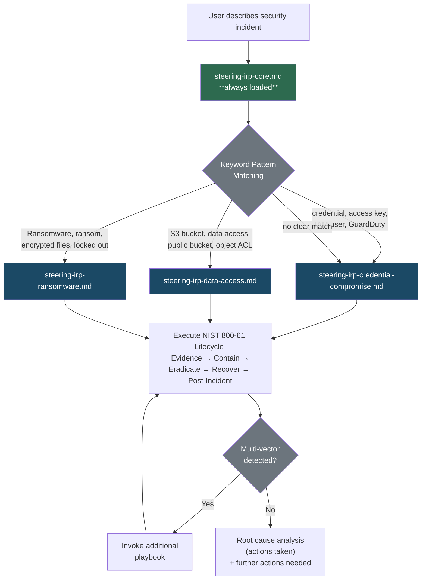

# AI-Powered Incident Response Automation
This README relates specifically to this directory subsection of the aws-incident-response-playbook repository. The markdown files in this directory are to be used to create - and then use - a set of guidance files that can be used with your AI-powered IDE of choice and will assist you to respond to security incidents.

These markdown documents are created to be used as templates only. They should be customized by administrators working with AWS to suit their particular needs, risks, available tools and work processes. These files are not official AWS documentation and are provided as-is to customers using AWS products and who are looking to improve their incident response capability, by powering it with artificial intelligence ("AI").

These markdown documents are written to facilitate editing and consumption into a variety of integrated development environments ("IDE"s) as guidance files. [In Kiro, these are known as "steering files"](https://kiro.dev/docs/steering/) and [in Claude Code, they are known as "skills"](https://code.claude.com/docs/en/skills). In both examples, the files are written in markdown for consumption into the relevant IDE.

Note that you need to copy the files in this repo into the correct directory in your IDE. In Kiro, we recommend setting up a new project, and defining a [workspace](https://kiro.dev/docs/steering/) and keeping your steering files in the steering directory *for the workspace*. Steering files specific to the workspace will take priority over global steering files. This also means that you don't risk having steering files in the global workspace that you don't want there, and having kiro reference those files when you are in a workspace for a project completely unrelated to those steering files. Refer to the sections below to ensure you have copied the files to the correct location for your IDE. 

For Kiro, users should do similar preparation to move steering files to .kiro/steering/ folder 

The markdown documents included cover several common scenarios faced by AWS customers. They outline steps based on the [NIST Computer Security Incident Handling Guide](https://csrc.nist.gov/pubs/sp/800/61/r3/final) (Special Publication 800-61 Revision 3) and codify these steps as structured guidance that AI agents can use to assist a human operator investigate and resolve an incident. This includes the following steps outlined by NIST:

* Gather evidence
* Contain and then eradicate the incident
* Recover from the incident
* Conduct post-incident activities, including post-mortem and feedback processes

## Usage
### Kiro IDE
1. Copy the `ai-playbooks/steering/steering-irp-core.md` into your workspace's `.kiro/steering` directory
2. Copy the `ai-playbooks/steering/reference` directory and all files in it into the `.kiro/steering` directory

`mkdir -p .kiro/steering && cp ai-playbooks/steering/steering-irp-core.md .kiro/steering/ && cp -r ai-playbooks/steering/reference .kiro/steering/`

#### File types
There are three categories of markdown files we have created for this AI-powered incident response solution:

* **Steering Factory**: Use the `.kiro-steering/steering-factory/steering-factory-creation-guide.md` to create your own incident response steering files. This file is _only_ used when you want to create new `steering-irp-<playbook>.md` steering files
* **Steering Core**: The `.kiro-steering/steering-irp-core.md` file is _always_ used when you are using the Kiro IDE to investigate and respond to a security incident. The `steering-irp-core.md` file can be saved under `.kiro/steering/` within a given workspace. We recommend you create a [separate workspace](https://kiro.dev/docs/editor/multi-root-workspaces/) specifically for incident response.
* **Steering Incident Response**: These files are invoked as needed based on the initial problem description given by the operator; the steering core file helps Kiro make a decision about which incident-specific playbook to load. These files are also. stored under `.kiro/steering/` along with the core file.

#### How the files direct Kiro IDE
The core file (steering-irp-core.md) is set to inclusion: always, so it's loaded into every conversation automatically. It acts as the orchestrator — it defines the NIST 800-61 lifecycle, contains keyword pattern matching logic to classify the incident type, and then tells the AI which specific playbook to pull in.

The incident-specific files (such as "credential compromise", "unintended data access", and "ransomware") are all inclusion: manual. They don't load unless explicitly invoked. But the core file's keyword matching logic determines which one(s) to invoke based on what the operator describes.

So the flow is:

User describes a security incident
Core file (always loaded) kicks in, analyzes the prompt against its keyword patterns
Core file directs the AI to invoke the appropriate manual steering file(s)
The specific playbook guides the actual IR steps
It's essentially a router pattern — one always-on dispatcher that selectively activates specialized playbooks on demand. And since each manual file also lists all three playbooks in its description front matter, the AI knows about the other playbooks even when it's deep in one specific response, so it can pivot if the incident turns out to be multi-vector (e.g., credential compromise leading to ransomware).

The "Tool Selection Strategy" section in the core file is also a nice touch — it tells the AI to prefer MCP tools over CLI when available, without requiring us as authors to maintain two versions of every command.

### Claude Code
1. copy `ai-playbooks/skills/CLAUDE.md` to the root directory of the project  
2. copy all other skills file in `ai-playbooks/skills/` folder into the `.claude/skills/` folder

`cp ai-playbooks/skills/CLAUDE.md . && mkdir -p .claude/skills && find ai-playbooks/skills -name '*.md' ! -name 'CLAUDE.md' -exec cp {} .claude/skills/ \;`

## Security

See [CONTRIBUTING](CONTRIBUTING.md#security-issue-notifications) for more information.

Artificial intelligence can make mistakes. Ensure that operators carefully check and verify output.

## License Summary

The documentation is made available under the Creative Commons Attribution-ShareAlike 4.0 International License. See the LICENSE file.

The sample code within this documentation is made available under the MIT-0 license. See the LICENSE-SAMPLECODE file.